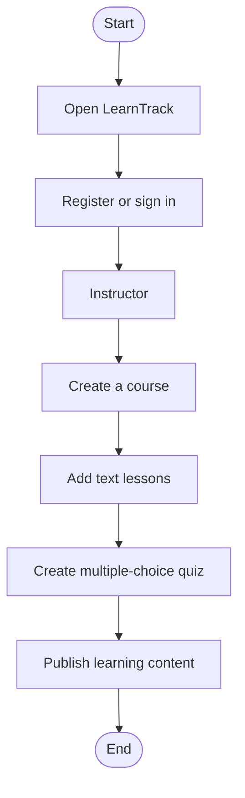
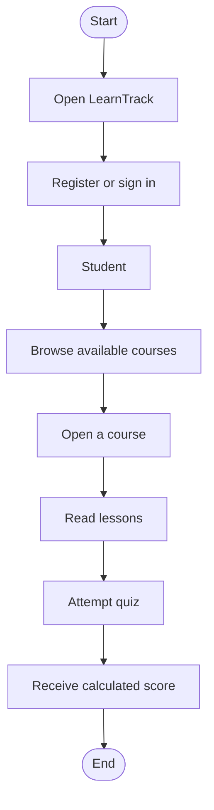

# LearnTrack — User Workflow Sketch

These diagrams describe the intended user journeys for the project.

## Instructor workflow

```mermaid
flowchart TD
    A([Start]) --> B[Open LearnTrack]
    B --> C[Register or sign in]
    C --> D[Instructor]
    D --> E[Create a course]
    E --> F[Add text lessons]
    F --> G[Create multiple-choice quiz]
    G --> H[Publish learning content]
    H --> I([End])
```

## Student workflow

```mermaid
flowchart TD
    A([Start]) --> B[Open LearnTrack]
    B --> C[Register or sign in]
    C --> D[Student]
    D --> E[Browse available courses]
    E --> F[Open a course]
    F --> G[Read lessons]
    G --> H[Attempt quiz]
    H --> I[Receive calculated score]
    I --> J([End])
```
